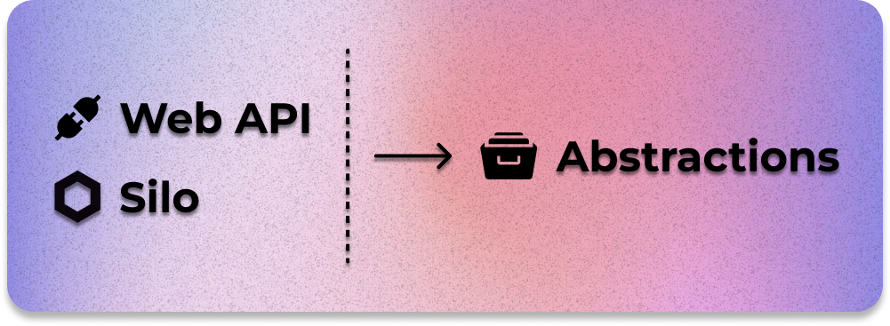
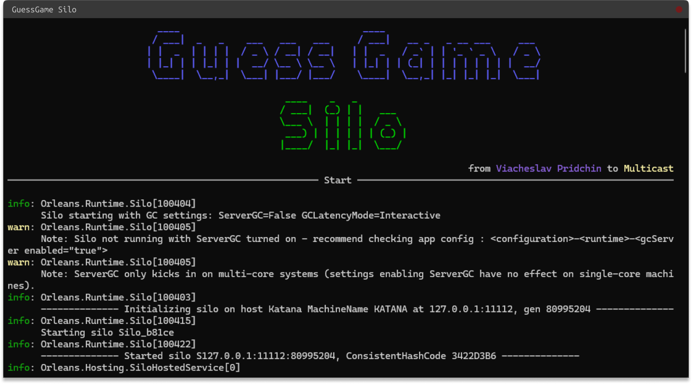
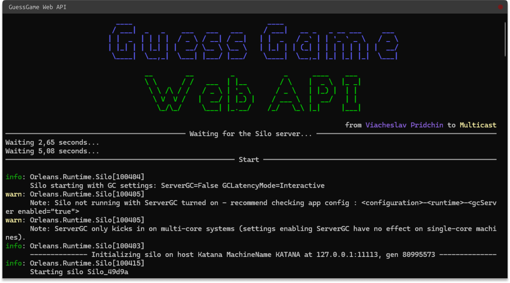

# GuessGame Server

Данный репозиторий содержит реализацию серверной составляющей игры "Guess Game". 
Основные условия реализации проекта:
- Новый игрок, подключаясь к серверу, попадает в очередь;
- Когда в очереди собираются два игрока, они попадают в комнату, где сервер загадывает число от 0 до 100;
- Попав в комнату, игрок загадывает число от 0 до 100 и вводит его, отправляя на сервер;
- Игрок, назвавший число, наиболее близкое к загаданному сервером, получает очко;
- Очки каждого игрока сохраняются в базе данных с использованием встроенной в Orleans системы хранения.

[Unity Клиент](https://github.com/VyacheslavPridchin/GuessGame_UnityClient)

## Реализация
Было принято решение разделить Back-end на 3 проекта: Abstractions, Silo и WebAPI. 



### Abstractions
Библиотека абстракций, которая используются для связи проектов без передачи реализации.

Структура проекта:
- 📂 Grains
  - 📄 IReceptionGrain.cs
  - 📄 IQueueGrain.cs
  - 📄 IGameRoomGrain.cs
- 📂 State
  - 📄 IGameRoomState.cs
  - 📄 PlayerState.cs

### Silo
Программный узел, где исполняются реализации Grain. Каждый Silo подключается к кластеру Orleans, а также имеет доступ к БД MySQL через систему хранения Persistence.



Структура проекта:
- 📄 Program.cs
- 📂 Grains
  - 📄 ReceptionGrain.cs
  - 📄 QueueGrain.cs
  - 📄 GameRoomGrain.cs
- 📂 State
  - 📄 ReceptionState.cs
  - 📄 ScoreState.cs
  - 📄 GameRoomState.cs

### WebAPI
Программный Web сервер, который реализует API для взаимодействия с кластером Orleans. 



Структура проекта:
- 📄 Program.cs
- 📄 Payload.cs
- 📄 ResponseWrapper.cs
- 📂 Controllers
  - 📄 BaseController.cs
  - 📄 ReceptionController.cs
  - 📄 QueueController.cs
  - 📄 GameRoomController.cs

## Архитектура


Кластер Orleans остается изолированным от прямого доступа со стороны клиента. Взаимодействие с кластером возможно исключительно через сервер "прослойку", который имеет доступ к кластеру. В данном проекте это сервер AspNetCore, реализующий HTTP API. Такое решение позволяет ограничить доступ к кластеру от внешнего вмешательства, обеспечив котролируемое взаимодействие. Еще одной причиной является программное ограничение - версия Orleans 8.X, на котором реализован сервер, не поддерживает .Net Standart 2.X, на котором работает Unity - соответственно, нет возможности собрать библиотеку с реализацией Orleans.Client под этот движок.

### API

Стандартный формат ответа:

```json
{
    "statusCode": [Код статуса.],
    "errorMessage": [Сообщение ошибки, если есть.],
    "data": [Данные, если есть.]
}
```

В `data` может вернуться любой тип данных. Далее в документации будет указываться возвращаемый тип.

<details><summary>Reception API</summary>
 
#### Reception

##### `POST /reception/check_in`

Регистрирует нового игрока, сохраняет и возвращает его уникальный идентификатор.

**Body:**

```json
{
    "Data" : "{{nickname}}"
}
```

**Response:** `Guid`

---

##### `GET /reception/get_players`

Возвращает список всех зарегистрированных игроков.

**Response:** `Dictionary<Guid, PlayerState>`

---

##### `GET /reception/get_score`

Возвращает счет текущих игроков.

**Response:** `Dictionary<Guid, long>`

---

##### `GET /reception/get_player`

Возвращает информацию о конкретном игроке.

**Query Parameters:**

- `playerId`

**Response:** `PlayerState`

---

##### `POST /reception/check_out`

Удаляет регистрацию текущего игрока.

**Request Body:**

```json
{
    "Data" : "{{playerId}}"
}
```

---

</details>

<details><summary>Queue API</summary>
 
#### Queue

##### `POST /queue/join`

Добавляет игрока в очередь.

**Request Body:**

```json
{
    "Data" : "{{playerId}}"
}
```

---

##### `GET /queue/get_invitation`

Получает приглашение для игрока, возвращает ID комнаты.

**Query Parameters:**

- `playerId`

**Response:** `Guid`

---

##### `GET /queue/get_players`

Возвращает список всех игроков в очереди.

**Response:** `List<Guid>`

---

##### `POST /queue/leave`

Удаляет текущего игрока из очереди.

**Request Body:**

```json
{
    "Data" : "{{player_id}}"
}
```

---

</details>

<details><summary>GameRoom API</summary>
 
#### GameRoom

##### `POST /gameroom/{{room_id}}/join`

Присоединяет текущего игрока к игровой комнате.

**Request Body:**

```json
{
    "Data" : "{{player_id}}"
}
```

---

##### `POST /gameroom/{{room_id}}/guess_number`

Отправляет предположение игрока для текущей игры.

**Request Body:**

```json
{
    "Data" : 
    {
        "PlayerId" : "{{player_id}}",
        "Number" : {{number}}
    }
}
```

---

##### `GET /gameroom/{{room_id}}/get_players`

Возвращает список всех игроков в игровой комнате.

**Response:** `List<Guid>`

---

##### `GET /gameroom/{{room_id}}/get_current_action`

Возвращает текущие действия в игровой комнате.

**Response:** `ActionState`

---

##### `GET /gameroom/{{room_id}}/get_winners`

Возвращает список победителей в игровой комнате.

**Response:** `List<Guid>`

---

##### `GET /gameroom/{{room_id}}/get_true_number`

Возвращает загаданное сервером число для текущей игры.

**Response:** `int`

---

</details>

Эта документация охватывает все конечные точки для GuessGame Web API. Используйте базовый URL и заменяйте заполнители (`{{url}}`, `{{player_id}}`, `{{room_id}}`, `{{number}}`) фактическими значениями при выполнении запросов.
